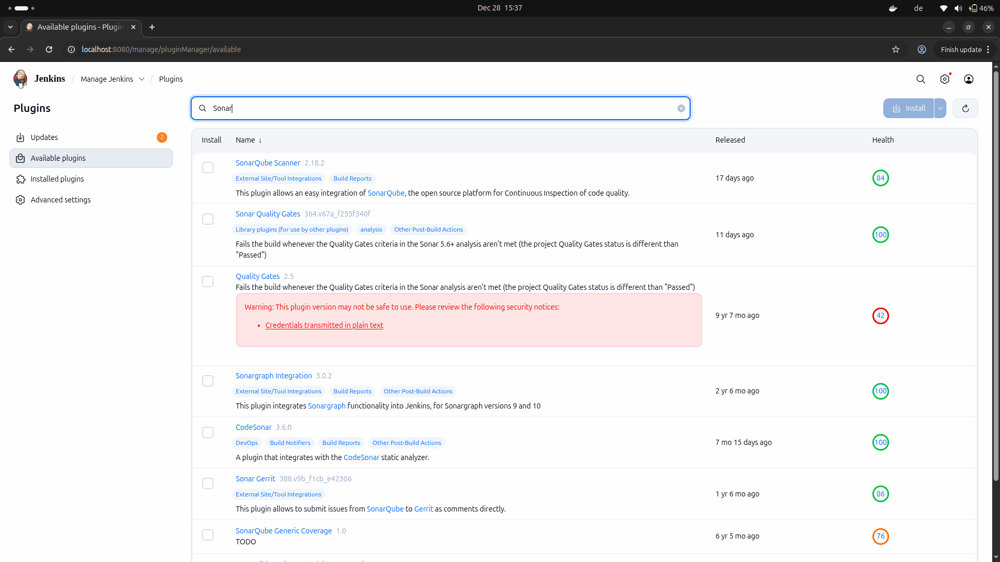
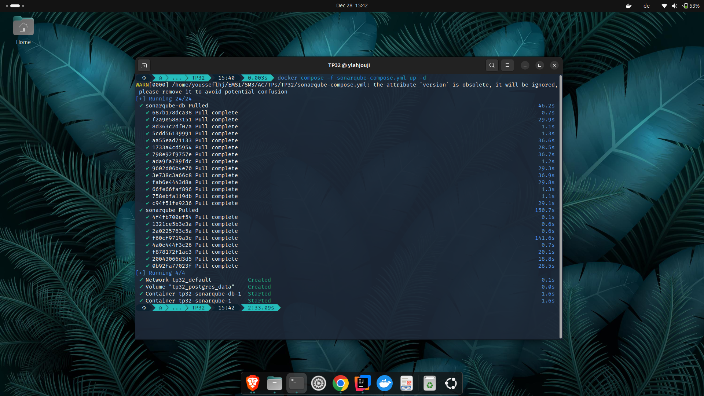
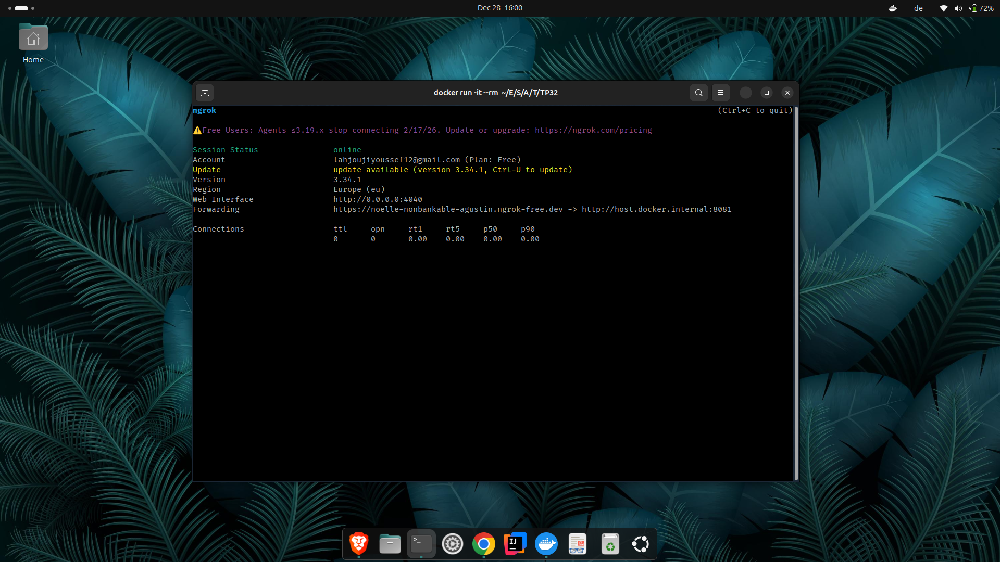
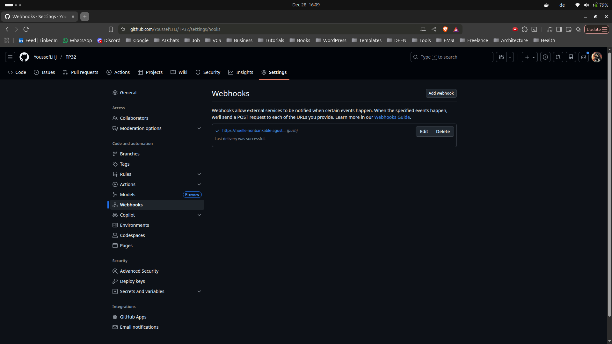
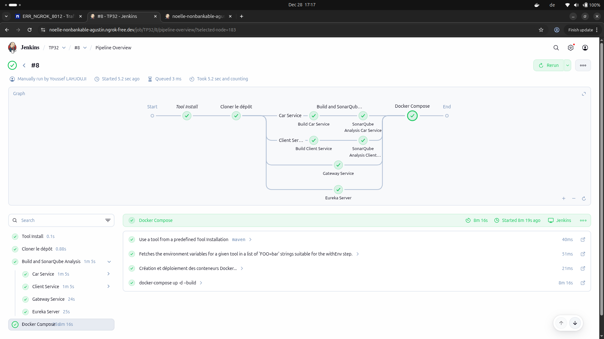
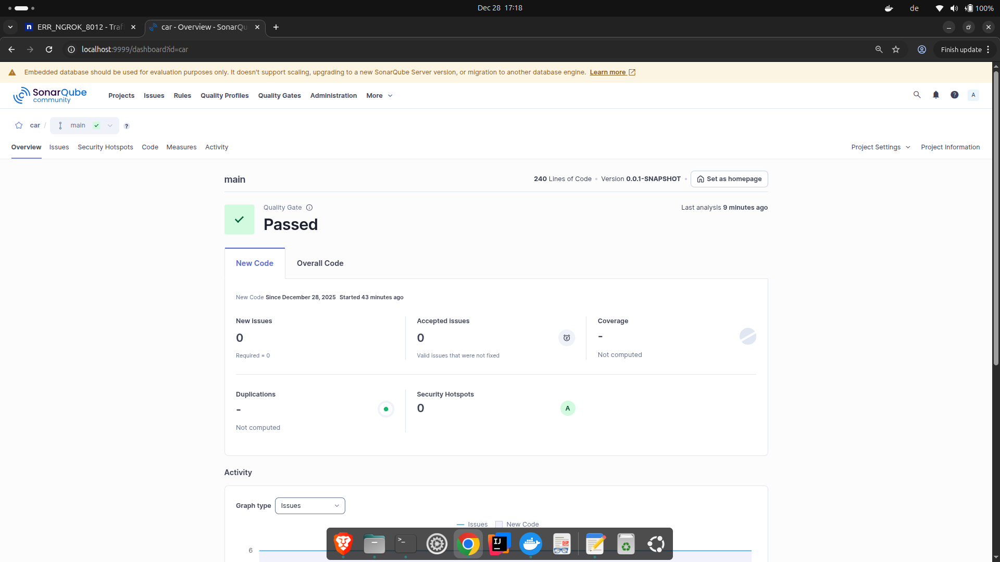

## 1. Recherche et installation du plugin SonarQube dans Jenkins

## 2. Démarrage de SonarQube avec Docker Compose

## 3. Exposition de Jenkins via Ngrok (accès distant sécurisé)

## 4. Configuration du Webhook GitHub pour l’intégration continue avec Jenkins

## 5. Exécution réussie du pipeline Jenkins avec analyse SonarQube et déploiement Docker

## 6. Résultat de l’analyse SonarQube : Quality Gate validé (Passed)

